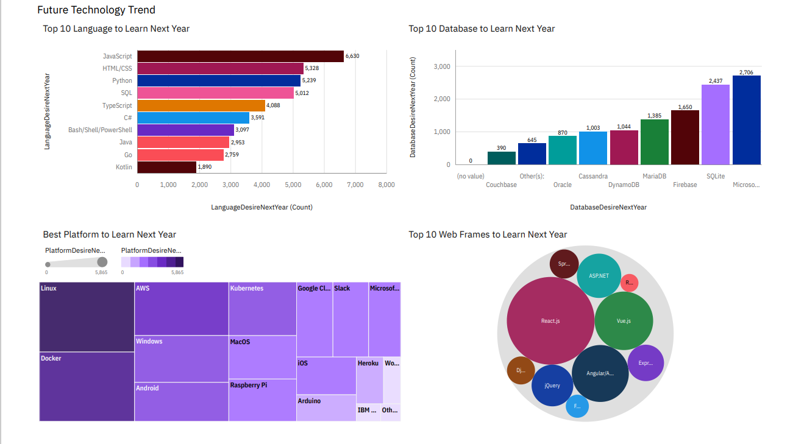

# Building a Dashboard with IBM Cognos Analytics
This is the final project for Week 5 of the IBM Data Analyst Capstone Project. The purpose of this project is for learners to demonstrate their IBM Cognos Analytics skills, learned in previous course, by creating various dashboards from a given dataset. 

The dataset for this project is [__the 2019 Stack Overflow Developer Survey Results Are In__](https://stackoverflow.blog/2019/04/09/the-2019-stack-overflow-developer-survey-results-are-in/). By creating dashboards, we hope to gain insights from this data, in particular the technologies developers use.

## Dashboard 1
Display trends of popular technology in areas including Language, Database, Platform, and Web Frame.

 

## Dashboard 2
Display future trends of technology, particularly what the participants want to learn in the next year.

 

## Dashboard 3
Display the demograpics of the people who participated in the survey. For this dashboard, man and woman were the only ones considered for gender.

 

